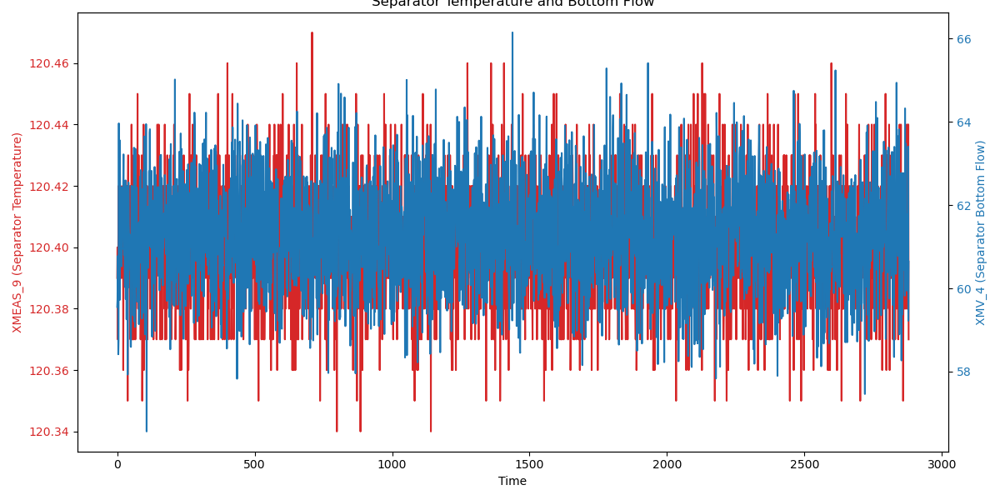

# MAS（多代理系統）架構、問題與優化建議

## 1. MAS 整體架構分析

這個專案實現了一個高度結構化、分層式的多代理系統（MAS），其設計精良，職責劃分清晰。其核心架構可以概括為「**帶有策略護欄的、可P2P協作的、分層式決策執行框架**」。

### 1.1 核心組件

*   **總指揮 (Supervisor)**: 位於決策的頂層。它不執行具體任務，只負責理解使用者意圖，並將任務**委派**給最合適的專家代理。它是團隊的「大腦」。
*   **專家代理 (Experts - ME, DE, DS)**: 位於執行層。每個專家都有自己獨立的工作流（Workflow）和專用工具集（Tools），負責解決特定領域的問題：
    *   `ME` (Machine Expert): 知識專家，負責從文檔中檢索和綜合資訊（RAG）。
    *   `DE` (Data Engineer): 數據工程師，負責與 SQL 資料庫互動，提供數據。
    *   `DS` (Data Scientist): 數據科學家，負責執行 Python 程式碼進行數據分析和建模。
*   **路由器 (Router)**: 位於 Supervisor 和專家之間，是系統的「神經中樞」。它負責執行 Supervisor 的委派指令，調用專家子圖，並管理專家之間可能發生的**對等（P2P）委派**，確保了複雜協作的順利進行。
*   **黑板 (Blackboard)**: 系統的「共享記憶體」。它是一個基於檔案的中央儲存，允許代理之間非同步地共享資訊（事實、數據集），實現了代理間的解耦。
*   **日誌與指標 (Logger & Metrics)**: 系統的「飛行記錄儀」。它記錄下每一次運行中發生的所有事件，為後續的性能評估、行為分析和錯誤診斷提供了數據基礎。

### 1.2 工作流程 (Flow of Control)

1.  **啟動**: 使用者在 `chat_cli.py` 中輸入問題。
2.  **高層決策**: `supervisor_workflow` 被觸發，`Supervisor` 代理根據使用者問題，決定將任務委派給哪個專家（例如，`delegate_to_de`）。
3.  **路由與執行**: `router.py` 接收到委派指令，調用 `delegate_tools.py` 中的相應函式，啟動 DE 專家的子工作流（`de_workflow.py`）。
4.  **專家自主工作**: DE 代理在其自己的 ReAct 循環中開始工作，使用 `de_tools.py` 中的工具（如 `sql_db_query`）與資料庫互動，直到產出一個數據集。
5.  **(可選) P2P 協作**: 如果 DE 在執行過程中需要 DS 的幫助來分析數據，它可以調用 `request_delegate` 工具。這個請求會被 `router.py` 捕獲，`router` 會暫停 DE 的工作，啟動 DS 的子圖，待 DS 完成後，將結果反饋給 DE 讓其繼續。
6.  **結果返回**: DE 完成任務後，其結果（例如，數據集的路徑）通過 `router` 作為 `ToolMessage` 返回給 `Supervisor`。
7.  **綜合與終結**: `Supervisor` 觀察到專家的回覆，可能會繼續委派給其他專家（例如，讓 DS 分析 DE 提供的數據），或者在收集到足夠資訊後，調用 `final_answer` 工具，給出最終答案，結束流程。



## 2. 潛在問題分析 (Bugs & Risks)

整體程式碼品質很高，但仍存在一些潛在的風險和可以改進的地方。

1.  **固定的圖表檔案名稱**: 在 `cross_corr_tool.py` 中，`plt.savefig('figures/cross_correlation_plot.png')` 使用了固定的檔案名稱。如果在一次分析中需要生成多張互相關圖，後續的圖表會覆蓋前面的，導致資訊丟失。這在 DS 代理的 Python 程式碼中也可能發生。

2.  **P2P 循環風險**: `router.py` 中的 P2P 委派循環雖然有 `_MAX_P2P_HOPS` 和 `MAX_GLOBAL_TOOL_CALLS` 作為護欄，但在極端情況下，仍然可能出現低效的循環。例如，ME 請求 DE，DE 又請求 ME，即使任務內容略有不同，也可能在達到上限前進行多次無效的來回傳遞。

3.  **環境變數依賴過重**: 系統的多個部分（`common.py`, `bb_tools.py`, `run_logger.py`）都依賴 `os.environ.get("RUN_ID")` 等環境變數。雖然 `chat_cli.py` 和 `common.py` 中的 `ensure_run_id` 盡力確保其一致性，但在更複雜的調用場景（例如，將此系統作為一個更大的系統的子模組）中，這種對全域環境變數的依賴可能變得脆弱，容易出錯。

4.  **RAG 索引的冷啟動**: `me_docs.py` 的索引建立是一個耗時的過程。雖然有快取機制，但第一次運行或文件更新後，使用者會經歷一次漫長的「冷啟動」等待。在互動式 CLI 環境中，這可能會影響使用者體驗。

## 3. 優化建議

1.  **檔案名稱唯一性**: 
    *   **建議**: 修改所有儲存檔案（特別是圖表）的工具，使其檔案名稱包含一個唯一識別碼。最簡單的方式是使用 `run_id` 和一個隨機字串或時間戳。
    *   **範例 (`cross_corr_tool.py`)**: 
        ```python
        import uuid
        run_id = os.environ.get("RUN_ID", "default_run")
        figure_path = f'figures/{run_id}_cross_corr_{uuid.uuid4().hex[:6]}.png'
        plt.savefig(figure_path)
        ```

2.  **強化 P2P 委派護欄**: 
    *   **建議**: 在 `router.py` 的 `_dedup_key` 函式中，除了任務文本，可以考慮加入「任務發起者」和「當前回合數」作為雜湊的一部分，使得「在同一回合內，A 對 B 的同一個請求」被視為重複，但「在不同回合，A 對 B 的同一個請求」則被允許。這可以防止在單次回合內發生快速的來回乒乓球式請求。

3.  **上下文傳遞而非環境變數**: 
    *   **建議**: 逐步重構程式碼，將 `run_id`, `task_id` 等核心上下文作為參數，通過 `state` 字典在函式調用鏈中顯式傳遞，而不是依賴全域的 `os.environ`。
    *   **好處**: 這會讓函式的依賴關係更清晰，單元測試更容易，並且使得系統更容易被整合到其他程式中。
    *   **範例**: `bb_tools.py` 中的函式可以修改為 `bb_write(state: dict, ...)`，並從 `state` 中獲取 `run_id`。

4.  **非同步索引建立**: 
    *   **建議**: 對於 `me_docs.py`，可以將索引的建立過程放到一個背景進程或一個獨立的 setup 腳本中。`chat_cli.py` 在啟動時可以先檢查索引是否存在且為最新，如果不是，可以提示使用者運行一次索引建立腳本，而不是讓其在互動過程中等待。

5.  **引入更嚴格的 Code Linting 與 Formatting**: 
    *   **建議**: 專案的程式碼風格基本一致，但引入 `black` 進行自動格式化，以及 `ruff` 或 `flake8` 進行程式碼品質檢查，可以進一步提升程式碼的一致性和可讀性，並自動發現一些潛在的語法問題。

6.  **增加單元測試**: 
    *   **建議**: 對於 `metrics.py`, `bb_tools.py` 等具有清晰輸入輸出的核心工具模組，為其編寫單元測試（使用 `pytest`）。這將確保在未來重構或添加新功能時，不會意外破壞現有的核心邏輯，是保證大型專案長期穩定性的關鍵。
